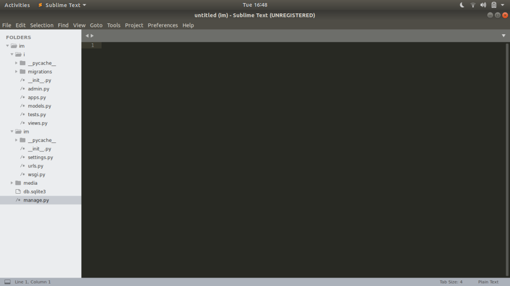

I started a tutorial through a website and found many interesting thing about this tutorial.I created a new blog app from this guide line and learnt a lot.

I started a django project by typing the command django-admin startproject and in this folder I created my app by typing the command django-admin startapp .These commands directs the django software in your machine and it creates many files related to this project. The hierarchy looks as follwing:

There are many files in it , but we need some files for creating small projects.At the begining of any project we have to register the application name in the settings.py  which consist the required things to control the application. After this we have to create the model for our project like ,if we are developing a contact page we need a Textblock  for name and E-mail  box. So we can add these fields in model.py to create a table to store these things in it. After creating a model we have to migrate the model into the database. Generally Django uses  its default database called sqlite. After all this we need views.py ,model.py and urls.py to connect them and put all the data to a html file which displays all the data which we are taking from a user or putting in it.

The confusing thing about Django is that you often need 4 different but interconnected files for one webpage: models.py, urls.py, views.py, and a template html file.I find it easiest to reason about this by going in order from models -> urls -> views -> template files.