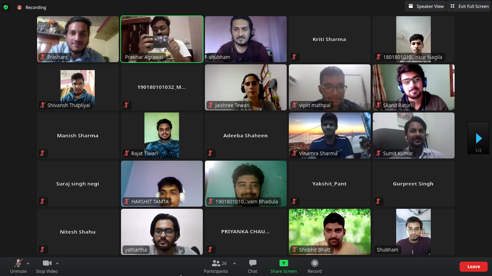
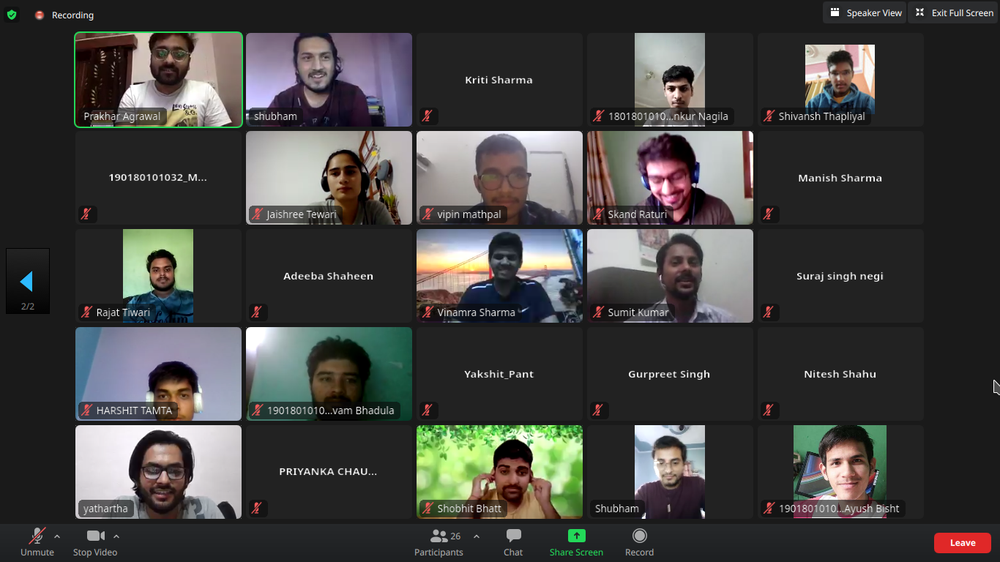

I don't know that this title is good or not. I was listening to the band called The Local Train at that time and just thought that maybe this is the perfect title for this story.

I think it's good to connect with your college alumni and seniors because they know how you can be better with your skill and, they help us to grow in our respective fields of interest. So yesterday our college alumni organized an event about the Hacktoberfest and the benefits of open source contribution. It was a great experience for me to take part in this event and, being a junior, it was also great to hear the seniors story when they were in college. I mentioned that seniors are the best person to explore your subject in detail because they already have gone through these subjects and, they know what part we are missing. So here is the technology called Git, GitHub, which is very useful for us but most of my batchmates don't know about that, but it's my luck that I know it and has some experience in it. So in this event, most of us created our first pull request and contributed to the open-source.

## What I learned 
 * Respect your work.
 * Be gentle to everyone.

I know these words are not enough to describe this meeting but I just wanted to make a note so that I can remember this day.
