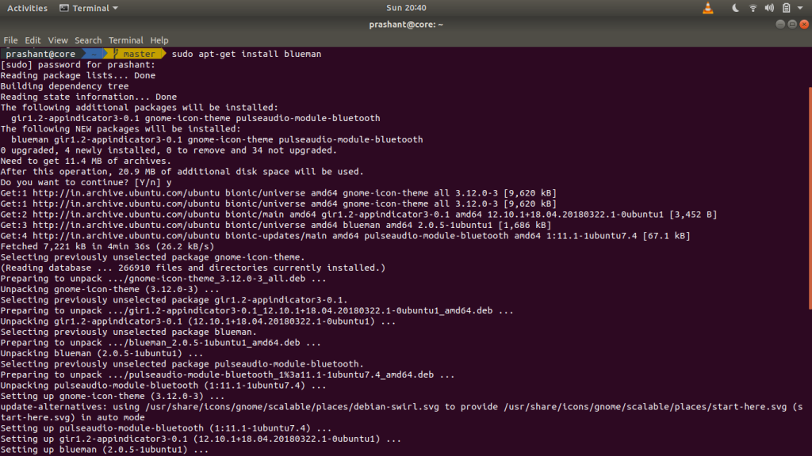
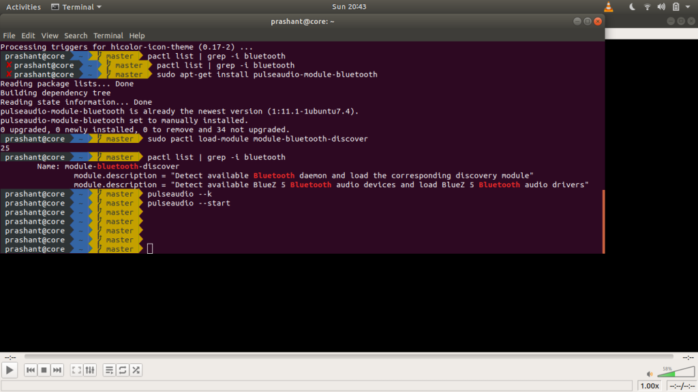
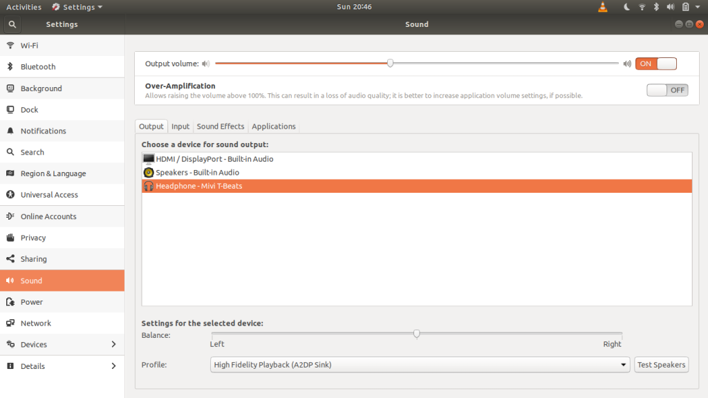

A few days ago I bought new headphones but my laptop not support the connection for wireless earphones.So I took some help from Google. After a few days I got a solution and started implementing it. So here is some steps:

### Step I

In my case I intalled blueman by using command sudo apt-get install blueman .This command install the needed dependencies.



### Step II

Then use pactl ``` list | grep -i ``` bluetooth to check Bluetooth modules are loaded or not. If ouput is empty this means that module is inactive.

### Step III

For the activation of module we have to download this module by using ```sudo apt-get install pulseaudio-module-bluetooth``` , this command install the package and for loading this module we have a manual command which is ```sudo pactl load-module module-bluetooth-discover```. After this we have to check module is loaded or not, so we run this command pactl ```list | grep -i bluetooth```. After all these steps the modules are activated.

### Step IV

The last step  is to kill the pulseaudio and restart it. For this the command is pulseaudio --k(for kill) pulseaudio --start(for start).



After this when you connect your headset with laptop then the sound setting start showing the headset and sink the audio with it.



TADA!!!