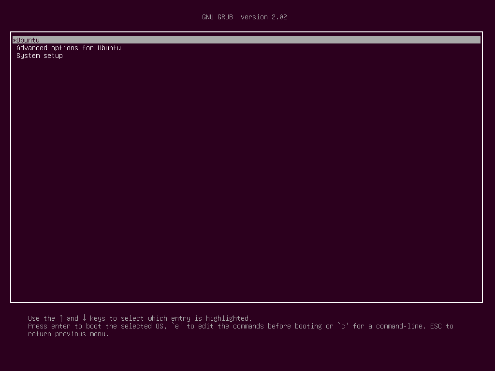

Using the Linux system is always a challenge for me because it's unpredictable when it shows errors. So today one of my friends from college set up a dual boot on his system which includes Ubuntu+Windows OS. 
But here we got a problem which states that if we power on our system it does not show any option to swap our operating systems or not showing the boot option.



So here is the solution for it:

Step 1: First check whether the windows installation location exists or find the windows setup files.

Step2: If not showing using Step1 you can also check it using a command line .

Step3: Open terminal using (ctrl+alt+t).

Step4: Type command ```sudo fdisk -l```. After this command, the booted drive will show.

Step5: Update your grub loader using ```sudo update grub```.

Step6: After this command restart the system and you will see the boot option there.


Thanks for reading it:)
