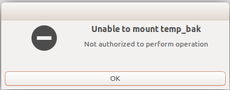
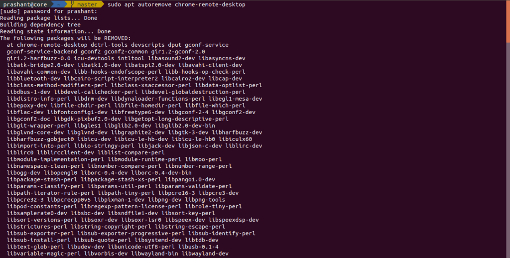

If you are afraid of something, like you are stuck or your attempt of doing something is failing for you, then read the whole story in this post.

Yesterday I shared my whole laptop screen using a chrome-remote-desktop with windows operated machine and mine was Linux(ubuntu) and something happened strange in my machine. I realized that problem when I was tried to open my harddisk partition and an error occurred that Not authorized to perform this operation! like this :



I also faced this type of problem, when I used the chrome-remote-desktop earlier but at that time the error was NTFS Fixing error and I used some command and that problem easily fixed. NTFS fixing error is common for Ubuntu and Windows OS in a shared machine because they share the same machine and also the same hard disk so the harddisk is automatically locked down due to this, and these type of error are easy to fix with ```sudo ntfsfix /dev/<device-name>``` when you want to use only Linux OS. 


If you are demotivated after giving your 100% to this problem and couldn't able to fix that error so please calm down because for every success you have to face some problem and also you have to keep walking because something good always is waiting for you.

After using so many commands copied from the google, I was able to fix that error but for the short time and that command is :

```sudo mount -t /dev/<disk-name> /media/<user>/<mounting-folder> ```

But this command fix is temporary because when I reboot my system it shows the same error again. Then I realized to go to the starting point that I started. Then I searched exactly that "Mount drive: Not Authorized to perform operation" and the answer was finally there waiting for me, so always remember one thing that if you are searching in google so keep your search exactly related to the context.

Finally, after so many attempts the answer was very simple and it was to remove the chrome finally, after so many attempts the answer was very simple and it was to remove the chrome-remote-desktop from your system and kill that process using ```sudo autoremove chrome-remote-desktop``` and everything came back easily.



The whole motto of this post is, you have to keep working whatever you are doing !!! Have a good day 